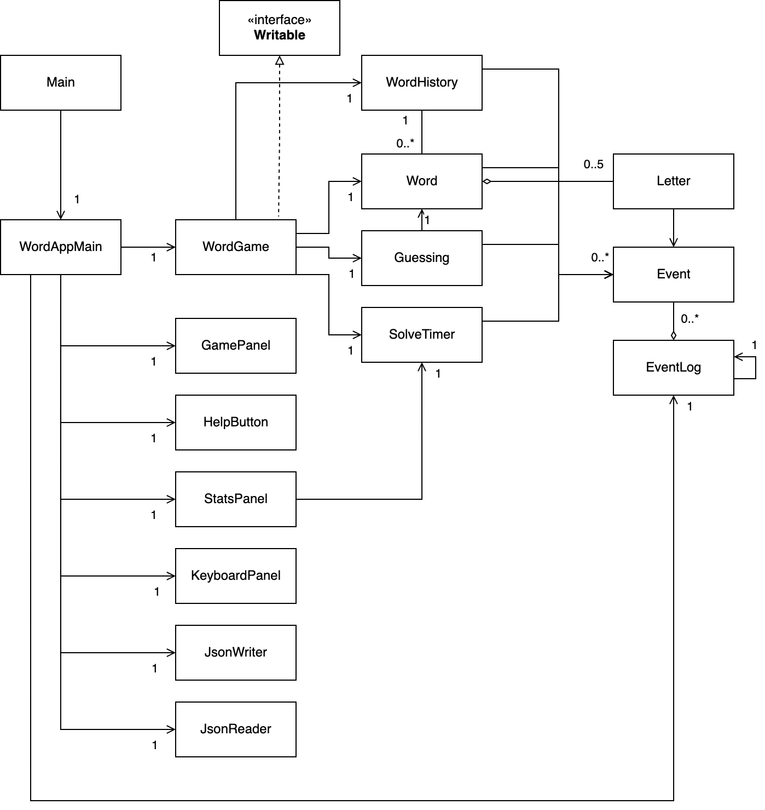

# MOTUS — Speed Wordle

Recklessly and arbitarily guessing words, this is beyond Wordle.

Without a fixed number of tries, your only frame of reference is the clock. 🏃‍♂️⏰

## Rationale

- What will the application do? You can play Wordle without any restriction on how many guesses you're allowed.
Instead, you are given a timer to look at.
- Who will use it? Anyone who likes Wordle, but wants to play more casually (without guessing constraints)
or even more competitively (trying to beat the clock).
- Why is this project of interest to you? Wordle is (in)famous within online tech circles for being simple, yet
perfectly apt for its casual use-case. I see a lot of potential to expand the Wordle concept,
so I might as well try it out in CPSC210 :)

## User Stories

- As a user, I want to be able to guess many words and have unlimited attempts.
- As a user, I want to be able to see if a letter is placed correctly, is mispositioned, or if it is not in a word.
- As a user, I want to be able to solve the puzzle quickly and use a timer to see how well I did.
- As a user, I want to be able to work on a puzzle and check the time whenever I want.
- (Phase 2) As a user, I want to be able to save a MOTUS game in its entirety to play it later.
- (Phase 2) As a user, I want to be able to reload a MOTUS game and resume right where I left off 
such that the timer is 'running' the entire time.

## How to run

From IntelliJ, navigate to `./src/main/ui/Main.java` and run the program.

## Phase 4 - Task 2

Thu Mar 31 22:36:52 PDT 2022
Set chosen word to would.

Thu Mar 31 22:36:52 PDT 2022
Instantiate timer.

Thu Mar 31 22:36:57 PDT 2022
Letter added to word: W

Thu Mar 31 22:36:57 PDT 2022
Letter added to word: A

Thu Mar 31 22:36:57 PDT 2022
Letter added to word: T

Thu Mar 31 22:36:57 PDT 2022
Letter added to word: E

Thu Mar 31 22:36:57 PDT 2022
Letter added to word: R

Thu Mar 31 22:36:59 PDT 2022
Word has been entered by user.

Thu Mar 31 22:36:59 PDT 2022
Word is incorrect.

Thu Mar 31 22:36:59 PDT 2022
Word added to history: water

Thu Mar 31 22:37:01 PDT 2022
Letter added to word: W

Thu Mar 31 22:37:02 PDT 2022
Letter added to word: A

Thu Mar 31 22:37:02 PDT 2022
Letter added to word: S

Thu Mar 31 22:37:02 PDT 2022
Letter added to word: T

Thu Mar 31 22:37:03 PDT 2022
Letter added to word: R

Thu Mar 31 22:37:04 PDT 2022
Letter removed from word.

Thu Mar 31 22:37:04 PDT 2022
Letter added to word: E

Thu Mar 31 22:37:05 PDT 2022
Word has been entered by user.

Thu Mar 31 22:37:05 PDT 2022
Word is incorrect.

Thu Mar 31 22:37:05 PDT 2022
Word added to history: waste

Thu Mar 31 22:37:07 PDT 2022
Letter added to word: W

Thu Mar 31 22:37:09 PDT 2022
Letter added to word: I

Thu Mar 31 22:37:09 PDT 2022
Letter added to word: N

Thu Mar 31 22:37:09 PDT 2022
Letter added to word: D

Thu Mar 31 22:37:09 PDT 2022
Letter added to word: Y

Thu Mar 31 22:37:09 PDT 2022
Word has been entered by user.

Thu Mar 31 22:37:09 PDT 2022
Word is incorrect.

Thu Mar 31 22:37:09 PDT 2022
Word added to history: windy

Thu Mar 31 22:37:12 PDT 2022
Opening and writing to ./data/history.json

Thu Mar 31 22:37:12 PDT 2022
Game state has been converted to JSON.

Thu Mar 31 22:37:12 PDT 2022
Saved current game to ./data/history.json

Thu Mar 31 22:37:21 PDT 2022
Letter added to word: W

Thu Mar 31 22:37:26 PDT 2022
Letter added to word: A

Thu Mar 31 22:37:27 PDT 2022
Letter removed from word.

Thu Mar 31 22:37:38 PDT 2022
Letter added to word: O

Thu Mar 31 22:37:38 PDT 2022
Letter added to word: U

Thu Mar 31 22:37:38 PDT 2022
Letter added to word: L

Thu Mar 31 22:37:38 PDT 2022
Letter added to word: D

Thu Mar 31 22:37:38 PDT 2022
Word has been entered by user.

Thu Mar 31 22:37:38 PDT 2022
Word has been solved.

## Phase 4 - Task 3
- I would reduce the coupling of WordGame's dependencies. E.g. A word does not need to know about 4 different model 
class objects at once, it should be able to obtain that from WordGame.
- I would improve the cohesion of JsonWriter and JsonReader: some of largest persistence methods related to JsonWriter 
and JsonReader are mainly located in WordAppMain, but they should be moved to JsonWriter and JsonReader.
- Writable interface seems underutilized by WordGame, possibly useless.
- Not many uses of interfaces or abstract classes throughout the entire design. Could have been used in model classes
that have similar method names and signatures (e.g. there are multiple toJson methods).

